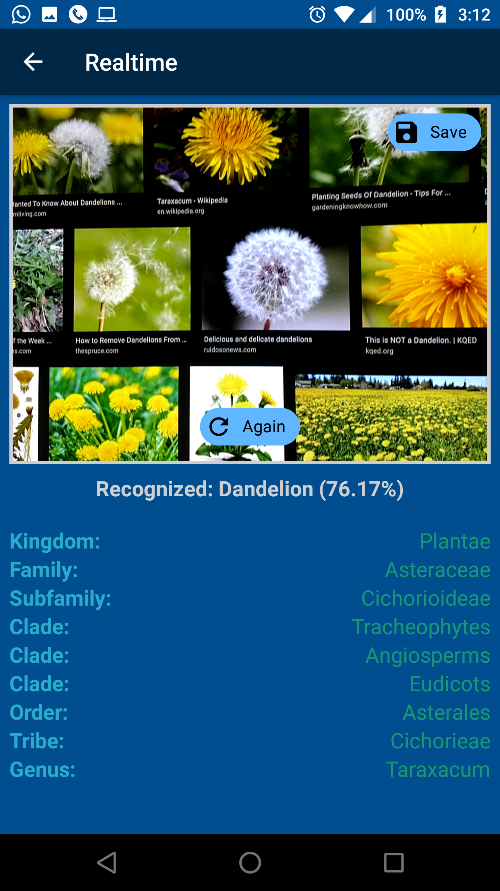
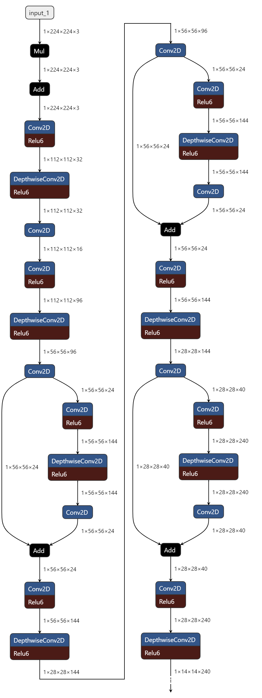
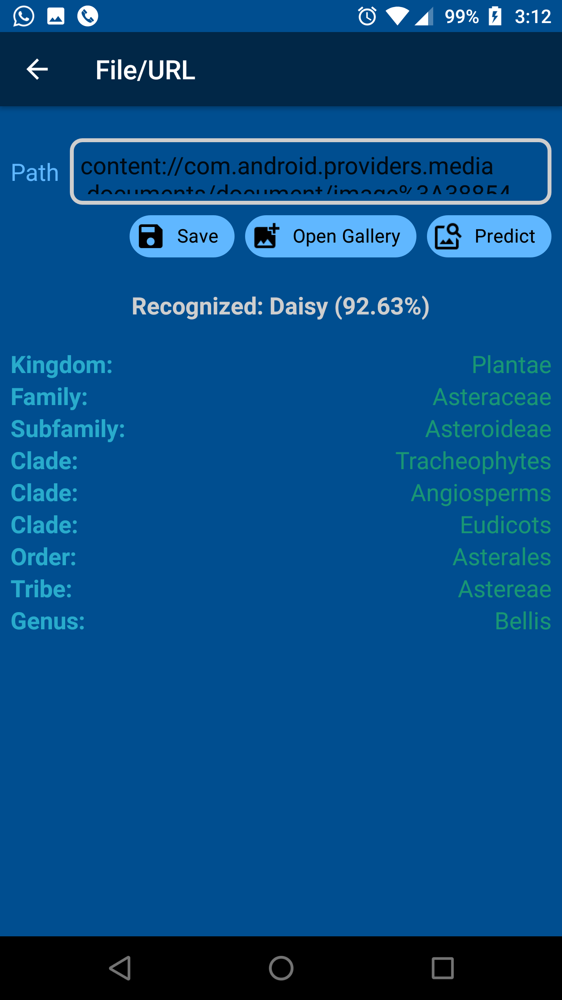
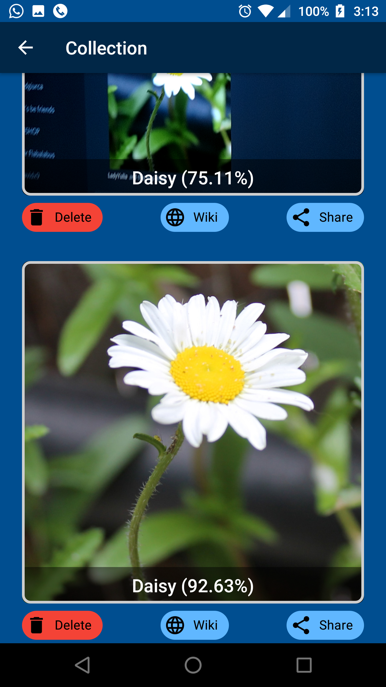

# ClassifAI
This repository contains a machine learning project focused on recognizing flower species. It consists of two main components:

- A trainer Python application, used for training a TensorFlow Lite Convolutional Neural Network on a dataset consisting of images of five different flower species.

- A client Android application that utilizes the model trained to recognize flower species. It can identify flowers either from static images or live camera feeds.

## Dependencies
To run this project, you need:
* **Python 3+** (optional, for training the neural model - the trained model is already included in this repo, if you want to use it as is and not re-train it from scratch)
* **TensorFlow Lite library** - For inference on mobile devices using TFLite models built for Android apps that can be developed with Java or Kotlin programming languages, respectively.
* **Android Studio IDE** - For developing, testing and compiling the Android app.

## Python Model Training

  

The Python script `deep_neural_network_classifier.py` handles training a Deep Neural Network classifier using the [TensorFlow](https://www.tensorflow.org/api_docs/python/tf/) and [Keras APIs](https://keras.io/api/).

It downloads and extracts the Flower Photos dataset from TensorFlow, consisting of 3670 photos of 5 flower species - daisies, dandelions, roses, sunflowers and tulips.

The images are split 80/10/10 into training, validation and test sets respectively.
Several data augmentation techniques are applied to the training set, including random rotations, flips and zooms. This expands the effective size and diversity of the training dataset.

The model architecture is a Convolutional Neural Network (CNN) with the following layers:

- 3 [Convolution2D](https://keras.io/api/layers/convolution_layers/convolution2d) layers for feature extraction
- 3 [MaxPooling2D](https://keras.io/api/layers/pooling_layers/max_pooling2d) layers for spatial dimensionality reduction
- 1 [Dropout layer](https://keras.io/api/layers/regularization_layers/dropout) to prevent overfitting
- 1 [Flatten layer](https://keras.io/api/layers/reshaping_layers/flatten)
- 1 [Dense hidden layer](https://keras.io/api/layers/core_layers/dense) with 128 units
- 1 Output layer with 5 nodes (one per flower class)

  

The model is trained for 15 epochs with a batch size of 32, using the [Adam optimizer](https://arxiv.org/abs/1412.6980) and [Sparse Categorical Crossentropy](https://www.tensorflow.org/api_docs/python/tf/keras/losses/SparseCategoricalCrossentropy) loss function.

Model training and validation plots are generated to visualize accuracy and loss metrics.

The trained model is exported to [TensorFlow Lite format](https://www.tensorflow.org/lite/api_docs), applying [full integer quantization](https://www.tensorflow.org/lite/performance/post_training_integer_quant) for optimized size, suitable for mobile processing power. Metadata including category labels is also embedded.

## Android Recognition App

  
  
  

The Android app provides real-time flower recognition functionality using the TFLite model trained with the Python couterpart application.

The main `RealtimeRecogActivity` activity shows a live camera preview and runs analysis on each frame.

The `ImageAnalyzer` class handles frame processing, invoking the `Classifier` to run inference using the TFLite Interpreter API.

Recognition results with confidence scores are displayed on screen. Photos of recognized flowers can be captured and saved to the device storage.

The app demonstrates how an offline on-device ML model can enable real-time intelligent features, specifically optimized for the computational constraints typical of mobile devices.

  

## License

This project is licensed under the GPLv3.0. See the [LICENSE](./documents/LICENSE.md) file for details.